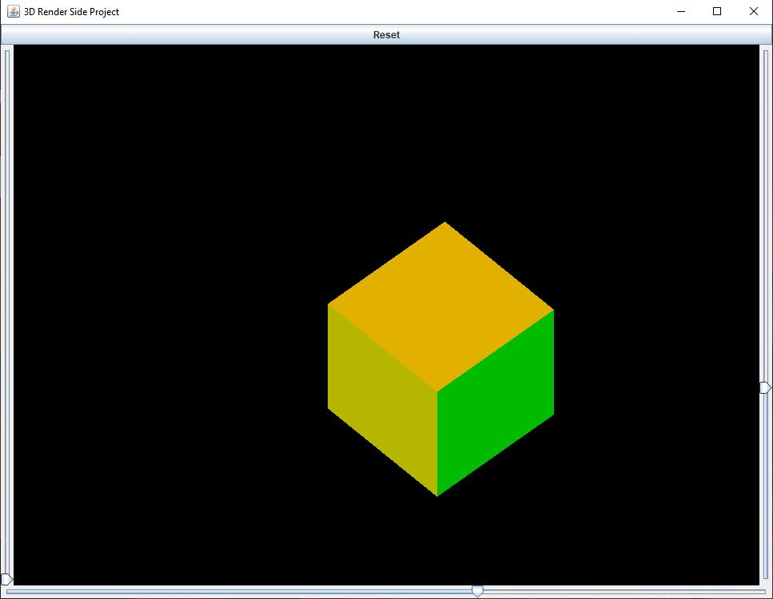

# 3DRenderEngine
## Description:
A simple 3D render engine which can be used to render a variety of 3D shapes with a simple lighting and depth system. This was just something I created to gain a better understanding of Linear Algebra applications in 3D rendering.
Currently, it only gives the user the option to simply inspect the shape.

### Linear Algebra concepts used:
* Rotation Matrices
* Translations
* Shapes in R^3

### Cube example:
